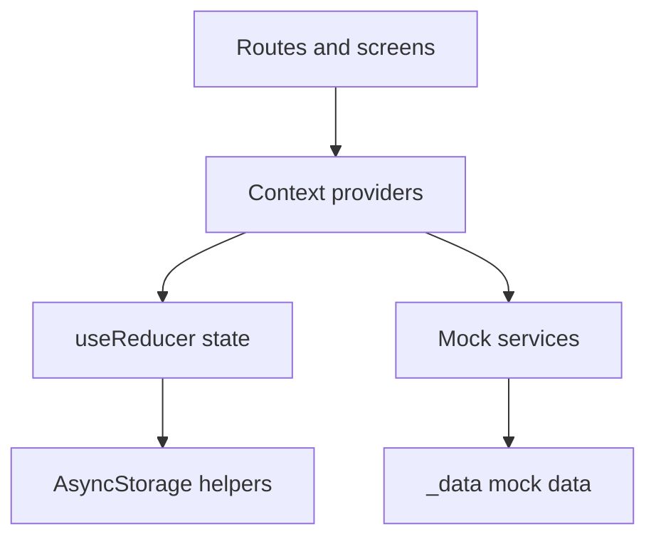
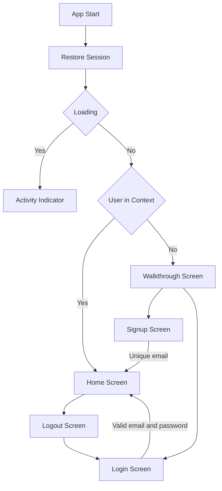
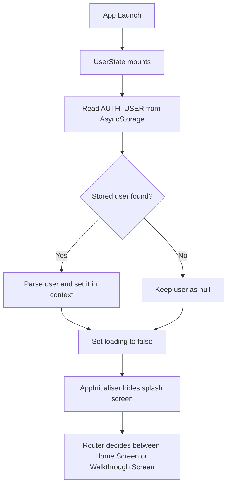

# Task Tracker

Task Tracker is a small mobile productivity app built with React Native, Expo, and TypeScript. This document acts as both a project README and a lightweight software requirements / use-case document for the delivered application.

## Purpose

The goal of the app is to provide a simple, clean task-tracking experience for a signed-in user without requiring a backend. The app focuses on:

- fast task capture
- task completion tracking
- filtering tasks by status
- local persistence across app restarts
- a clear onboarding and authentication flow

## Product summary

The current implementation supports:

- a splash screen that stays visible while session restore completes
- a walkthrough screen shown whenever the user is signed out
- local signup and login with persisted email and password checks
- a home screen with categories and task list UI
- task creation, completion toggle, and filtering
- per-user task persistence using AsyncStorage
- a logout flow with a dedicated logout screen

## Scope

### In scope

- local authentication only
- local task persistence only
- one primary home/task management experience
- walkthrough, login, signup, home, and logout screens

### Out of scope

- remote backend or API
- password recovery
- social login
- task sharing or collaboration
- push notifications
- server-side sync

## Primary actor

`User`

The user can sign up, sign in, create tasks, complete tasks, filter tasks, review categories, and log out.

## Functional requirements

### Authentication

- The app must allow a new user to sign up with name, email, and password.
- The app must store signed-up users locally.
- The app must enforce unique email addresses.
- The app must allow login only when a stored email and matching password exist.
- The app must persist the authenticated user session locally.
- The app must allow logout.

### Walkthrough and routing

- The app must restore the last signed-in session on startup.
- The app must keep the splash visible while session restore is loading.
- If a user is signed in, the app must route to the home screen.
- If a user is signed out, the app must route to the walkthrough screen.

### Task management

- The app must allow a user to create a task.
- The app must prevent empty task creation.
- The app must allow toggling a task between complete and incomplete.
- The app must support the filters `all`, `active`, and `completed`.
- The app must store tasks locally.
- The app must scope tasks to the current user.

## Use cases

### Use case 1: Create an account

1. User opens the app while signed out.
2. App shows the walkthrough.
3. User navigates to signup.
4. User enters name, unique email, and password.
5. App stores the user locally.
6. App signs the user in and routes to home.

### Use case 2: Sign in to an existing account

1. User opens the app while signed out.
2. App shows the walkthrough.
3. User navigates to login.
4. User enters email and password.
5. App checks local stored users.
6. If the credentials match, app signs the user in and routes to home.

### Use case 3: Create a task

1. Signed-in user opens the home screen.
2. User enters text in the task input.
3. User submits the task.
4. App validates the title.
5. App adds the task to context state.
6. App persists the updated task list for that user.

### Use case 4: Complete a task

1. Signed-in user views the task list.
2. User taps a task row or its action control.
3. App toggles the `completed` value.
4. App persists the updated tasks.
5. UI updates the item style and the filtered lists.

### Use case 5: Return after restart

1. User closes the app.
2. User opens the app again.
3. App restores the saved session from AsyncStorage.
4. App restores tasks for that user from the user-specific storage key.
5. User returns to the home screen with the previous task list intact.

### Use case 6: Log out

1. User taps the profile avatar.
2. App opens the profile action sheet.
3. User taps `Logout`.
4. App routes to the logout screen.
5. User confirms logout.
6. App clears the saved auth session and routes to login.

## Setup

**Prerequisites:** Node.js 18+, npm, Expo Go or a simulator/emulator

```bash
git clone <repo-url>
cd task-tracker-rn
npm install
npx expo start
```

Useful commands:

```bash
npx expo start
npx expo start --clear
npx tsc --noEmit
```

## Libraries and rationale

| Library | Why it is used |
|---|---|
| `expo-router` | File-based routing keeps navigation structure explicit and easy to reason about. |
| `nativewind` + `tailwindcss@3` | Simplifies styling and keeps design-token usage consistent. |
| `@react-native-async-storage/async-storage` | Provides simple, local key-value persistence for auth and tasks. |
| `expo-splash-screen` | Prevents layout flash by keeping the native splash visible until session restore completes. |
| `react-native-safe-area-context` | Handles safe area insets correctly on iOS and Android. |
| `react-native-screens` | Required peer for the Expo Router stack setup. |
| `@expo/vector-icons` | Provides consistent, cross-platform icons instead of emoji or text glyph placeholders. |
| `clsx` + `tailwind-merge` | Supports the `cn()` helper for conditional class handling. |
| `react-native-svg` | Used to render the walkthrough decorative illustration. |

## How the app works

At a high level, the app starts in `app/_layout.tsx`, mounts global providers, restores the auth session, hides the splash when loading completes, and then routes based on whether a user exists in context.

Once a user is authenticated:

- `TaskState` is mounted with `userId`
- tasks are loaded from AsyncStorage using a user-specific key
- all task actions update reducer state first
- then the updated state is persisted back to AsyncStorage

The app intentionally keeps the business logic in state providers and services instead of screens. Screens are mostly responsible for:

- rendering data
- collecting user input
- calling context methods
- handling route transitions

## Architecture



### Architecture explanation

- `app/` contains thin Expo Router entry files only.
- `screens/` contains actual screen UI and screen-specific handlers.
- `context/` owns global app state.
- `api/services/` provides mock auth and task service behavior.
- `storage/` abstracts local persistence.
- `components/` contains reusable UI building blocks.

This structure keeps the app readable because routing, UI, state, and persistence each have a clear home.

## Why Context API was used

Context API with `useReducer` was chosen because it is the best fit for the size and complexity of this app.

### Why it fits this app

- The app has two small global domains: `user` and `tasks`.
- Both domains are needed in multiple screens.
- State transitions are simple and predictable.
- There is no backend sync, pagination, or heavy server cache layer.
- The app benefits from a central place for actions such as `login`, `signup`, `logout`, `addTask`, `toggleTask`, and `setFilter`.

### Why `useReducer` inside Context

`useReducer` was used instead of several `useState` calls because it:

- centralizes state transitions
- makes actions explicit
- scales better as task/user logic grows
- keeps mutation rules in one place

For example, task updates are easier to reason about when all writes pass through reducer actions like:

- `SET_TASKS`
- `ADD_TASK`
- `TOGGLE_TASK`
- `SET_FILTER`

## Folder structure

### `app/`

Expo Router route entry files. These files should stay thin. Their job is to connect route paths to screen components and layouts.

- `app/_layout.tsx`: root provider tree, splash wiring, and top-level stack
- `app/index.tsx`: initial route decision
- `app/(onboarding)/`: walkthrough route group
- `app/(auth)/`: login, signup, and logout route group
- `app/(tabs)/`: authenticated app area

### `screens/`

Real screen implementations. This is where each full screen UI lives.

- `walkthrough-screen.tsx`
- `login-screen.tsx`
- `signup-screen.tsx`
- `logout-screen.tsx`
- `home-screen.tsx`

### `components/`

Reusable view-level building blocks used across screens.

- `task-item.tsx`: single task row
- `task-input.tsx`: add-task control
- `filter-tabs.tsx`: all/active/completed selector
- `category-card.tsx`: category summary card
- `empty-state.tsx`: empty-list fallback UI
- `ui/`: lower-level shared primitives

### `context/`

Global app state containers.

- `context/user/`: auth/session state
- `context/task/`: task list and filter state

These providers expose methods to the rest of the app and own reducer-based updates.

### `hooks/`

Convenience wrappers around context access and onboarding behavior.

- `use-user-context.ts`
- `use-tasks-context.ts`
- `use-onboarding.ts`

### `storage/`

AsyncStorage helper layer. This keeps read/write logic away from screens.

- `task-storage.ts`: loads and saves tasks with a user-scoped key

### `api/`

Mock service layer that simulates backend-like logic.

- `api/services/user.service.ts`: signup/login rules using local storage
- `api/services/tasks.service.ts`: task-related mock service behavior
- `api/hooks/`: lightweight wrappers for service access

### `_data/`

Static mock data used by the mock services and UI.

- categories
- starter task data
- base user shape

### `types/`

TypeScript interfaces for tasks, categories, users, and auth payloads.

### `helpers/`

Action constants used by reducers.

### `constants/`

Theme tokens such as colors, spacing, radius, and typography values.

### `lib/`

Project utilities such as `cn()` for composing class names safely.

### `assets/`

Images and design assets used by splash and walkthrough screens.

## App flow

Plain-text version:

```text
App Start
  |
  v
Restore Session
  |
  v
Loading?
  |-- Yes --> Activity Indicator
  |
  `-- No --> User in Context?
             |-- Yes --> Home Screen
             |             |
             |             v
             |         Logout Screen
             |             |
             |             v
             |         Login Screen
             |
             `-- No --> Walkthrough Screen
                           |---> Signup Screen --(unique email)---> Home Screen
                           |
                           `---> Login Screen --(valid email/password)---> Home Screen
```



## Restore session flow

Plain-text version:

```text
App Launch
  |
  v
UserState mounts
  |
  v
Read AUTH_USER from AsyncStorage
  |
  v
Stored user found?
  |-- Yes --> Parse user and set it in context
  |-- No ----> Keep user as null
  |
  v
Set loading to false
  |
  v
AppInitialiser hides splash screen
  |
  v
Router decides between Home Screen or Walkthrough Screen
```



## Key implementation notes

- Splash hiding is controlled from inside the provider tree so user loading is available before the splash disappears.
- `TaskState` is mounted only when a user exists, which prevents unauthenticated task access.
- Tasks are stored with a user-specific key, so different accounts do not share the same task list.
- Login and signup are local-only, but they behave like a minimal real auth system:
  - email uniqueness is enforced
  - password is persisted locally for validation
  - existing accounts are reused across sessions

## What I would improve with more time

- Add real backend authentication and secure password handling instead of local mock auth storage.
- Add task editing, deletion, and bulk actions beyond the current complete/incomplete flow.
- Add due dates, reminders, and richer task metadata such as notes or priority.
- Add automated test coverage for auth, restore-session, and task persistence flows.
- Add stronger form validation and user-friendly error states for invalid email formats and edge cases.
- Improve Android and iOS parity for typography and asset generation so visuals match more closely across devices.
- Add dark mode, accessibility tuning, and larger-text support.
- Add cloud sync so tasks and accounts are portable across devices.
- Refine animation polish for transitions, bottom sheets, and task state updates.
